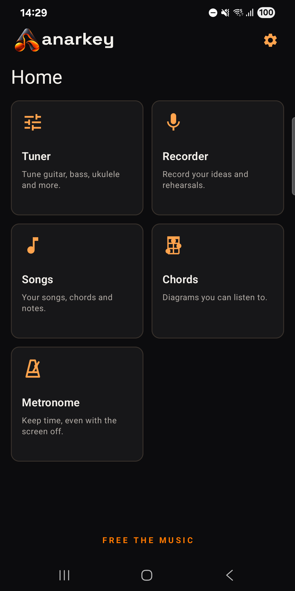
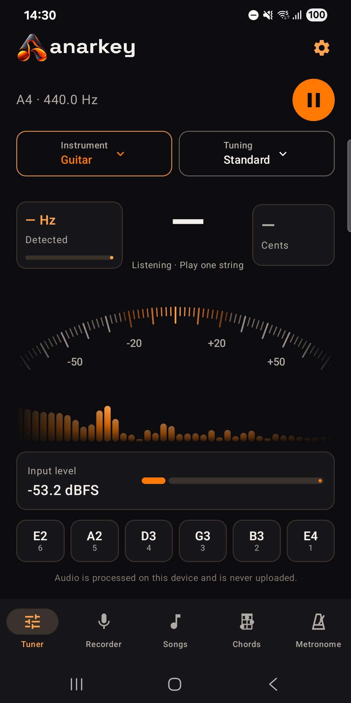
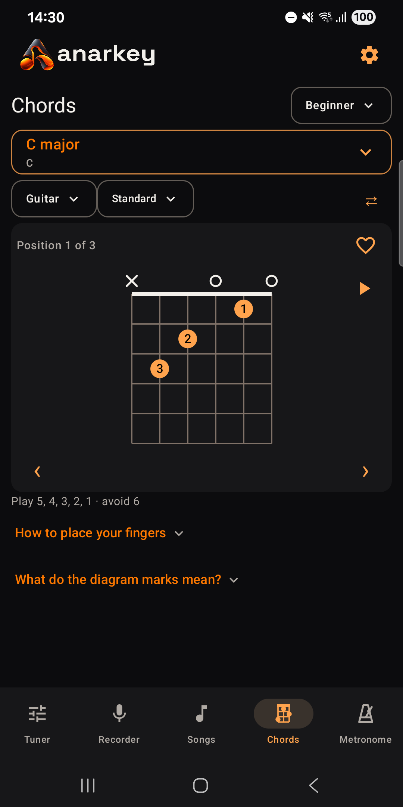
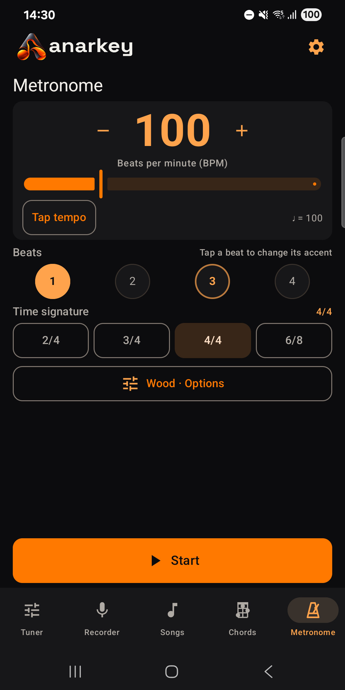
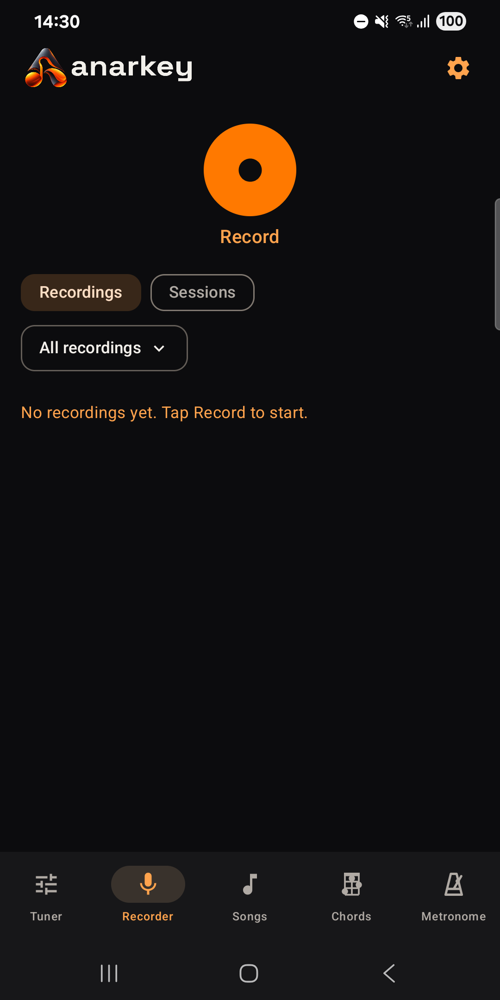

# Anarkey

### FREE THE MUSIC. NOT YOUR WALLET.

Free, open-source music tools for Android. Built for musicians, not shareholders.

A tuner, recorder, songbook with chords, chord dictionary, and metronome. Everything you need to make music. Absolutely nothing you need to create an account for.

**No ads. No subscriptions. No purchases. No accounts. No analytics. No tracking.**

No Internet permission, either. We couldn't track you even if we suddenly developed an interest in your personal life.

Everything works offline. Microphone audio stays on your device. Recordings and preferences are stored locally.

**Your music. Your phone. Your business.**

## Screenshots

_Actual screenshots. No marketing department was harmed in their creation._







## What does it do?

- **Tuner:** Helps you get in tune. Because confidence is not a substitute for frequency.
- **Recorder:** Capture ideas and rehearsals before your brain decides they never happened. Organize recordings into sessions.
- **Songs:** Keep your songs, anchored chords, notes, and related recordings organized. Transpose chords when needed.
- **Chord dictionary:** Find fingerings, explore alternative positions, and hear how chords sound.
- **Metronome:** Keeps time. Unlike that drummer joke we're not going to make.

All tools are available to everyone. No premium version exists, and none is hiding behind a suspiciously expensive button.

## The tuner situation

The tuner supports guitar, bass, ukulele, violin, mandolin, banjo, and chromatic tuning.

You can choose different instrument tunings, adjust the reference frequency (400–480 Hz), and display notes as letters or solfege, with sharps or flats.

**A note about accuracy:** Pitch detection works, but readings can fluctuate as a plucked string decays. We're still improving stability on real instruments.

We believe in testing things before claiming they work. A controversial position, apparently.

## Privacy: We don't want your data

Anarkey works entirely offline and doesn't request Internet access.

- Microphone audio is processed locally.
- Recordings stay on your device.
- Preferences are stored locally.
- No analytics, telemetry, advertising SDKs, or user accounts.
- Diagnostic audio exports, when available, are initiated manually and stored locally.

The tuner uses the microphone only while its screen is active. The recorder and metronome can continue working with the screen off through foreground services and visible notifications.

The full policy is here: [English](https://pablopramparo.github.io/anarkey/privacy/) · [Español](https://pablopramparo.github.io/anarkey/privacy/es/).

**Your phone is not a data collection opportunity.**

## Build it yourself

Because open source means you can actually build the thing.

Requirements: JDK 17, Android SDK 36, and Internet access to download initial build dependencies. The installed app itself works offline.

```powershell
.\gradlew.bat :core:test :app:testDebugUnitTest :app:assembleDebug :app:lintDebug
```

On macOS/Linux, use `sh gradlew` with the same tasks.

Set `ANDROID_HOME`, or add `sdk.dir=/path/to/Android/Sdk` to an untracked `local.properties`.

Debug APK: `app/build/outputs/apk/debug/app-debug.apk`, installed as `org.anarkey.app.dev` separately from the release app.

For an installable build that preserves recordings across updates, use `:app:assembleRelease` and follow [AGENTS.md](AGENTS.md).

Open the project in Android Studio, sync, select a phone, and run `app`.

## Architecture

_Organized code. Questionable reasons for writing it._

- `core/`: Android-independent detection, music math, validation, and stabilization.
- `app/`: AudioRecord capture, lifecycle-owned coroutines, StateFlow/ViewModel, Jetpack Compose, Room, and DataStore.

Want the technical details? We have documentation. Quite a lot of it, actually.

- [Toolbox implementation and verification](docs/M1_IMPLEMENTATION.md)
- [Toolbox proposal](docs/TOOLBOX_PROPOSAL.md)
- [Research, provenance and technical decisions](docs/RESEARCH.md)
- [Test results and limitations](docs/VALIDATION.md)
- [Physical-device acceptance checklist](docs/DEVICE_ACCEPTANCE.md)
- [Chord catalogue](docs/CHORD_CATALOGUE.md)
- [Transposition implementation](docs/M6_IMPLEMENTATION.md)
- [Design decisions and their reasons](docs/DESIGN_DECISIONS.md)

Yes, there is documentation. Anarchy is not an excuse for undocumented code.

## Support the chaos ☕

Anarkey is free. No ads, tracking, paid features, or subscriptions. **And that's not going to change.**

If you find it useful and feel like supporting independent development, you can [sponsor my work on GitHub](https://github.com/sponsors/pablopramparo).

Sponsorship is entirely optional. It unlocks absolutely nothing.

No premium features. No special treatment. No shareholder meetings.

You can, however, help fund the **Department of Research & Delirium™**, an unofficial organization dedicated to investigating problems nobody has and building solutions nobody requested.

Our success metric is simple:

**“Holy shit. It actually works.”**

The app itself contains no donation links. Support lives here on GitHub.

## License and credits

Anarkey's code is licensed under MIT. The name and the logo are not: see [design-assets/README.md](design-assets/README.md) before reusing them in a fork.

YIN is adapted from Tunify under MIT, with preserved [third-party notices](THIRD_PARTY_NOTICES.md).

See the [contribution guidance](CONTRIBUTING.md), [code of conduct](CODE_OF_CONDUCT.md), and [security policy](SECURITY.md).

---

**Anarkey — Free the Music.**

_Built out of curiosity. Maintained through questionable time management._
